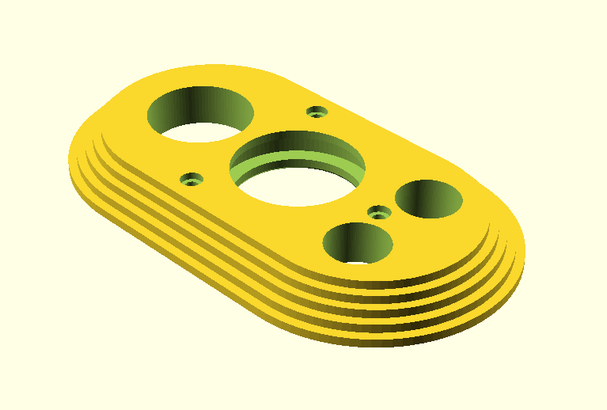
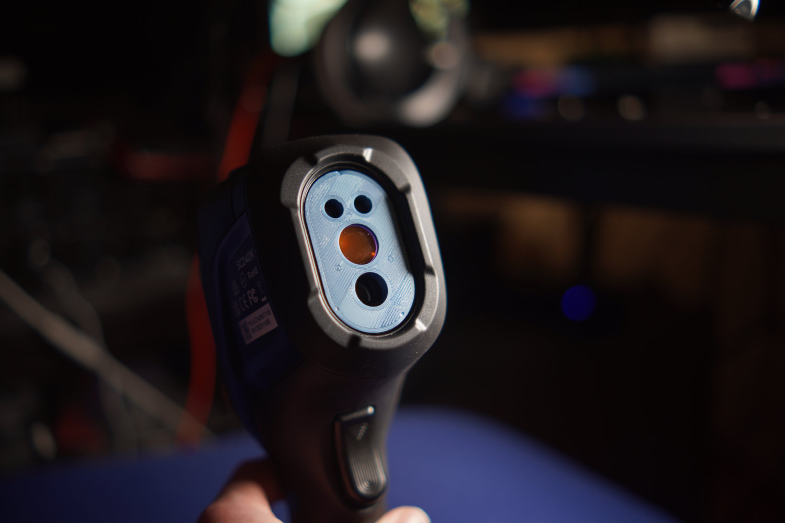
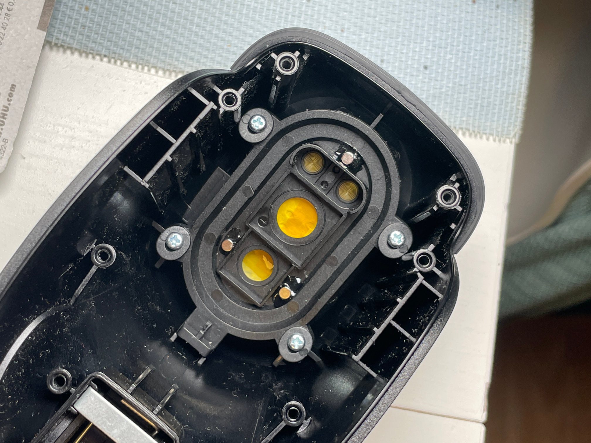

InfiRay C200 magnetic lense mount
=================================

The InfiRay C200 aka "Vevor SC240N" or "TopDon TC004" is a high 
framerate thermal imaging camera. From factory the minimum focus distance
is rather large. 

This 3D-printable part allows adding an extra 18mm lense in front of the
camera to reduce minimum focus distance from ~20cm to less than 5cm.  

The lens mount is attached magnetically to the camera body for easy
removal. This requires addition of three small magnets to the interior
of the case.

he following types of magnets are required:

4x 3mm⌀*3mm  
2x 3mm⌀*2mm  
1x 5mm⌀*4mm  

The single 5mm⌀*4mm and two of the 3mm⌀*3mm magnet are embedded into the
lense attachment itself. The remaining magnets are glued into the thermal
camera case as illustrated in above photo.

The magnets used need to be rather strong. Grade N45 or higher magnets
have been tested successfully.
